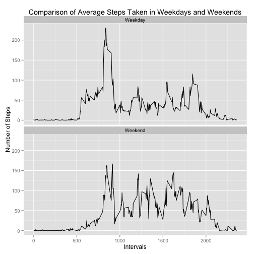

# Reproducible Research: Peer Assessment 1

This assignment makes use of data from a personal activity monitoring device. This device collects data at 5 minute intervals through out the day. The data consists of two months of data from an anonymous individual collected during the months of October and November, 2012 and include the number of steps taken in 5 minute intervals each day. (Carried over from README.md)

## Loading and preprocessing the data

I started by loading the data from the file __activity.zip__ present in this folder.
The dataset has three columns: the number of _steps_ taken during the 5-minute interval, the _date_, and the time of the _interval_ (from 000 to 2355, resulting in 288 intervals per day).


```r
originalData <- read.csv(unz("activity.zip", "activity.csv"),header=T)
```

After loading the data, I cleaned the resulting data set from empty (NA) values.


```r
cleanData <- originalData[complete.cases(originalData$steps),]
```

## What is mean total number of steps taken per day?

A good place to start when looking for information from the data is to see how many steps a
person takes during the day on average. First, let's calculate and make a histogram to see the distribution of the total number of steps in a day.


```r
dateSteps <- aggregate(cleanData$steps ~ cleanData$date, cleanData, FUN = sum)
colnames(dateSteps) <- c("date", "steps")
hist(dateSteps$steps, xlab = "Number of Steps Per Day", 
             main = "Histogram of Steps from Clean Data")
```

 

From the histogram we see that most often the person takes from 10,000 to 15,000 steps daily.

Next, let's calculate the mean:


```r
mean(dateSteps$steps)
```

```
## [1] 10766
```

and the median:


```r
median(dateSteps$steps)
```

```
## [1] 10765
```


## What is the average daily activity pattern?
Now let's see how the number of steps are distributed during the day and show the 
results in a line graph. First, I converted the five-minute intervals into factors and 
calcualted the mean of all the steps taken over all the days during the interval.

The graph shows how the activity changes during the day.


```r
cleanData$interval <- factor(cleanData$interval)
stepIntervals <- aggregate(cleanData$steps ~ cleanData$interval, cleanData, FUN = mean)
colnames(stepIntervals) <- c("interval", "steps")
stepIntervals$interval <- as.numeric(as.character(stepIntervals$interval))
plot(stepIntervals$interval, stepIntervals$steps, xlab = "Intervals", 
             ylab = "Number of Steps", main = "Average Number of Steps in Five-Minute Intervals", 
             type = "l")
```

 

Next, I searched for the busiest five-minute interval.


```r
maxSteps <- which.max(stepIntervals$steps)
stepIntervals$interval[maxSteps]
```

```
## [1] 835
```

In other words, the interval between 8:35 and 8:40 o'clock AM had the most steps taken on average during the two month period.

Out of interest, let's see how many steps our subject took at that time on average.


```r
max(stepIntervals$steps)
```

```
## [1] 206.2
```


## Imputing missing values
What happens, if we substitute the values that were not available with a meaningful value?
After all, there were quite many NA values. Let's see how many:


```r
nrow(originalData) - nrow(cleanData)
```

```
## [1] 2304
```

That's a big number. I chose to impute the missing values (NAs) with the mean value of the same interval across the days where there was a value.

I started by creating a copy of the original data frame and filled the NAs with mean values. After that I produced a histogram to compare with the one produced from the values that were cleaned from NAs. 


```r
newData <- originalData
newData$steps[is.na(newData$steps)] <- ave(newData$steps, newData$interval, FUN=function(x)
        mean(x, na.rm = TRUE))[is.na(newData$steps)]
newSteps <- aggregate(newData$steps ~ newData$date, newData, FUN = sum)
colnames(newSteps) <- c("date", "steps")
hist(newSteps$steps, xlab = "Number of Steps Per Day", 
        main = "Histogram of Steps from Imputed Data")
```

 

The resulting histogram looks quite similar to the one produced from cleaned data. Let's see if the corresponding mean and median values follow suit. First, the mean value:


```r
mean(newSteps$steps)
```

```
## [1] 10766
```

And then the median:


```r
median(newSteps$steps)
```

```
## [1] 10766
```

The mean value is exactly the same, and the median differs only by one step. It can be said that using mean values to impute the missing values doesn't make a notable difference in this case.

## Are there differences in activity patterns between weekdays and weekends?

There are still more interesting things to be found out from this data. For example, we could look if the subjet's activity pattern is different on weekdays than on weekends.

To prepare the dataset (using the new one with imputed values) for this, I first changed the dates from character format into date format. I calculated the mean value across the five-minute intervals in the new data frame (_newData_), and added a new column (_day_) where I created the factors that showed if the value was from a weekday or from weekend.

I chose to use __POSIXlt$wday__ instead of __weekdays()__ mentioned in the assignment instructions.

The locale was changed to US in order to make using the code easier for an international audience.


```r
Sys.setlocale(category = "LC_TIME", locale = "en_US.UTF-8")
newData$date <- strptime(newData$date, format = "%Y-%m-%d")
day <- as.POSIXlt(newData$date)$wday
newData$day <- as.factor(ifelse(day %% 6 == 0, "Weekend", "Weekday"))
weekendIntervals <- aggregate(newData$steps ~ newData$interval + newData$day, newData, FUN = mean) 
colnames(weekendIntervals) <- c("interval", "day", "steps")
weekendIntervals$interval <- as.numeric(as.character(weekendIntervals$interval))
```

After this, I made a graph for easy comparison between weekend and weekday activity. The __ggplot__ function achieves this quite nicely.


```r
library(ggplot2)
ggplot(weekendIntervals, aes(x=interval, y=steps)) + geom_line() + 
                facet_wrap(~day, ncol=1) + xlab("Intervals") + ylab("Number of Steps") + 
                ggtitle("Comparison of Average Steps Taken in Weekdays and Weekends")
```

 

There are clear differences to be seen between weekend and weekday activities. From looking at the graph it seems that on weekdays there's a sharp peak in the number of steps in the morning (going to work, maybe), whereas on the weekend there's not as much variation. 
